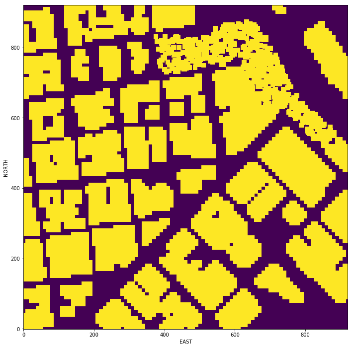

## Project: 3D Motion Planning

---

# Required Steps for a Passing Submission:
1. Load the 2.5D map in the colliders.csv file describing the environment.
2. Discretize the environment into a grid or graph representation.
3. Define the start and goal locations.
4. Perform a search using A* or other search algorithm.
5. Use a collinearity test or ray tracing method (like Bresenham) to remove unnecessary waypoints.
6. Return waypoints in local ECEF coordinates (format for `self.all_waypoints` is [N, E, altitude, heading], where the drone’s start location corresponds to [0, 0, 0, 0].
7. Write it up.
8. Congratulations!  Your Done!

## [Rubric](https://review.udacity.com/#!/rubrics/1534/view) Points
### Here I will consider the rubric points individually and describe how I addressed each point in my implementation.

---
### Writeup / README

#### 1. Provide a Writeup / README that includes all the rubric points and how you addressed each one.  You can submit your writeup as markdown or pdf.

You're reading it! Below I describe how I addressed each rubric point and where in my code each point is handled.

### Explain the Starter Code

#### 1. Explain the functionality of what's provided in `motion_planning.py` and `planning_utils.py`

`motion_planning.py` provides the basic implementation for motion planning including callback functions,
state transition functions, and the skeleton code for path planning. The implementation for Mavlink Connection between the simulator and our code is provided as well. Each callback function is executed
when the specific message has been received, such as MsgID.STATE. What we had to complete in this assignment
is plan_path method(or function) that is executed if the state is ARMING.

`planning_utils.py` provides several useful functions to implement the planning algorithms that we learned in the course, such as a function of A-star algorithm, creating a grid from the map data, available actions on a grid, and so on. I personally added more functions to this file for graph implementation and pruning.

And here is a lovely picture of our downtown San Francisco environment from above!

### Implementing Your Path Planning Algorithm

#### 1. Set your global home position
#Here students should read the first line of the csv file, extract lat0 and lon0 as floating point values #and use the self.set_home_position() method to set global home. Explain briefly how you accomplished this #in your code.

My code reads the first line using csf.reader with a delimeter ' ', and extract the lat0 and lon0 from the array, and then cast them to float type. Finally, I set the member variable, global_position, to the read position.

#### 2. Set your current local position
#Here as long as you successfully determine your local position relative to global home you'll be all set. #Explain briefly how you accomplished this in your code.

I used global_to_local function imported from frame_utils.py. What this function basically does is to convert the (latitude, longitude) coordinate to UTM-based coordinate. The local position (North and East in this case) can be obtained by subtracting the global home position from the global position in UTM-based coorindate.

#### 3. Set grid start position from local position
#This is another step in adding flexibility to the start location. As long as it works you're good to go!

We subtracted the offset from the local position to set the upleft vertex of the grid to (0,0). The offset of each element is simply the minimum value of the north and east coordinate values.

#### 4. Set grid goal position from geodetic coords
#This step is to add flexibility to the desired goal location. Should be able to choose any (lat, lon) #within the map and have it rendered to a goal location on the grid.

I just randomly chose the goal position that does not collide with an obstacle.

lat_goal = 37.795069 deg
lon_goal = -122.400942 deg

#### 5. Modify A* to include diagonal motion (or replace A* altogether)
#Minimal requirement here is to modify the code in planning_utils() to update the A* implementation to #include diagonal motions on the grid that have a cost of sqrt(2), but more creative solutions are welcome. #Explain the code you used to accomplish this step.

I added the four diagonal actions: North_East, North_West, South_East, and South_West. And, each of them has cost of sqrt(2) as described in the guide. The valid actions can be checked based on the same criteria that was used for the default actions.

#### 6. Cull waypoints
#For this step you can use a collinearity test or ray tracing method like Bresenham. The idea is simply to #prune your path of unnecessary waypoints. Explain the code you used to accomplish this step.

I added a colinearity_check and prune_path function to planning_utils.py. colinearity_check checks the determinant of the matrix that consists of the three position vectors. If the determinant is near zero, then the colinearity occurs. prune_path checks colinearity for each successive three waypoints using colinearity_check and prune out the middle point out of three way points.

### Execute the flight
#### 1. Does it work?
It works!

### Double check that you've met specifications for each of the [rubric](https://review.udacity.com/#!/rubrics/1534/view) points.

# Extra Challenges: Real World Planning

For an extra challenge, consider implementing some of the techniques described in the "Real World Planning" lesson. You could try implementing a vehicle model to take dynamic constraints into account, or implement a replanning method to invoke if you get off course or encounter unexpected obstacles.

